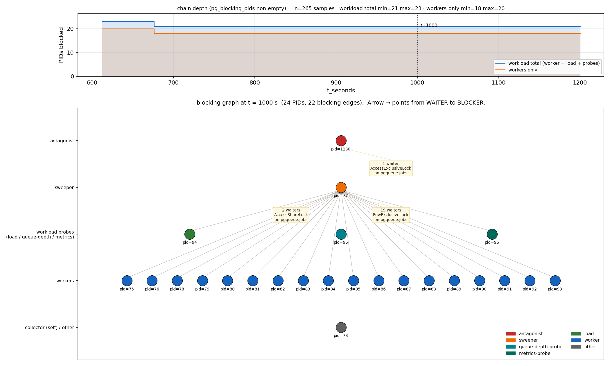

# pgqueue-java

A Postgres-backed job queue for the JVM — built to investigate a specific failure, not to be the ninth entry in a crowded field.

## The problem

`SELECT ... FOR UPDATE SKIP LOCKED` makes Postgres a serviceable job queue, and for most workloads it stays serviceable indefinitely. But under sustained load it has a known way of falling over, and the collapse is always the same shape:

A long-running transaction — a slow analytical query, an idle-in-transaction connection, a lagging replication subscriber — holds back the global xmin horizon. Autovacuum can no longer reclaim the dead tuples produced by the update-then-delete cycle of claiming and completing jobs. The jobs table grows. Index lookups slow down. Inserts slow down, because the indexes are full of dead entries. The `SKIP LOCKED` scan slows down, because it has to walk past more invisible tuples to find live work. Throughput drops, the backlog grows, and throughput drops further.

Brandur named this the queue death spiral at Heroku in 2015. PlanetScale reproduced it again in 2026 at 800 jobs/sec with an analytical workload running alongside. Modern Postgres raised the threshold; it did not change the mechanism.

Existing implementations mitigate it differently — aggressive per-table autovacuum settings, table partitioning with partition drops, append-only designs that avoid dead tuples by construction. There is not much public, controlled measurement of how far each one actually gets you.

## The question

**Can the collapse be reproduced deterministically, and which mitigations measurably prevent it?**

Everything in this repo exists to answer that. Features are added when an experiment needs them.

## What this is not

- **Not a production queue.** If you need one today, use pg-boss, River, Oban, or pgmq.
- **Not a benchmark that only reports wins.** Mitigations that didn't help get published too.
- **Not a distributed system.** One Postgres, one worker process type, no broker, no cluster. If something gets added to the stack, there is a measurement in this README justifying it.
- **Not an ORM project.** Plain JDBC throughout. The exact SQL, the index it uses, and the tuples it creates are the subject matter — hiding them would defeat the point.

## Status

Death spiral reproduced across R1–R3 — all three runs collapsed with the same causal chain (antagonist → held xmin → dead-tuple accumulation → throughput crater). Onset of degradation (`t_50`) is deterministic; deep-collapse onset (`t_25`) has more variance than pre-registered — see disclosure below.

- [x] Walking skeleton: schema, single-statement `SKIP LOCKED` claim path, virtual-thread worker loop, dual-mode load generator (open-loop and saturated)
- [x] Experiment specification — workload, antagonist, and a numeric definition of "collapse", written before any results exist ([`docs/experiment.md`](docs/experiment.md))
- [x] Observability spine: per-second Postgres metrics collector (dead tuples, heap and index size, oldest `backend_xmin` age), per-tick throughput/latency reservoir, and per-run CSV writer matching the spec's column set
- [x] Antagonist: REPEATABLE READ xmin-holder plus its verification query
- [x] End-to-end experiment runner and CLI producing one `results/<run-id>.csv` per run
- [x] Analyzer computing `B`, `t_50`, `t_25`, `final_ratio`, and collapse verdict into `results/<run-id>.meta.json`
- [x] **C1 control run** — 45 min saturated, no antagonist. `B = 1326.83 jobs/sec`, `final_ratio = 0.95`, collapse not declared. The experiment is valid to run.
- [x] **R1–R3 reproduction** — all three declared collapse. See table below.
- [ ] **C2 open-loop control** — spec'd in [`docs/experiment.md`](docs/experiment.md), not run. Blocked on the analyzer implementing Criterion B (queue-depth monotonic growth for 300 consecutive seconds with positive linear-regression slope); the open-loop workload path itself already ships. Not scheduled.
- [ ] **R4 open-loop reproduction** — spec'd, not run. Same Criterion-B blocker as C2. Not scheduled.
- [ ] **X1 causal control** — spec'd (`idle_in_transaction_session_timeout` set so the antagonist is forcibly rolled back mid-run, demonstrating throughput recovers once the xmin horizon releases). Not run. Blocked on wiring the timeout at antagonist-connection level and labelling the run as a control (not a mitigation) in CSV / meta.json.
- [ ] Mitigations, measured one at a time (M1–M5, per spec) — **M1, M2, M3 complete, none prevent collapse; M3 collapses harder than the baseline**
- [x] **M3b (out-of-spec variant, see [`docs/m3b.md`](docs/m3b.md))** — SUE-mode ATTACH sweeper. Confirms the ATTACH-fixes-CREATE hypothesis (0 ATTACH rows blocked across 2700 s). Still collapses via the intentionally-unchanged DROP path plus R1-shape dead-tuple bloat. `t_50 = 497 s`, earlier than M3's 549 s.
- [ ] Queue feature surface: retries with backoff, visibility timeout, DLQ, priorities, dedup
- [ ] Adapter for the public Postgres queue benchmark harness

### Reproduction results (R1–R3)

| run | B (jobs/sec) | t_50 | t_25 | final_ratio | collapse |
|-----|-------------:|-----:|-----:|------------:|:--------:|
| R1  | 1274 | 566 s | 1079 s | 0.130 | ✓ |
| R2  | 1341 | 537 s | 1114 s | 0.148 | ✓ |
| R3  | 1240 | 559 s | 1254 s | 0.169 | ✓ |

**Honest disclosure — pre-registered ±60 s bound violated.** The [experiment spec](docs/experiment.md) states R1–R3 count as deterministic reproduction only when their `t_25` values fall within ±60 s of one another. The observed `t_25` spread across R1–R3 is **175 s** (1079, 1114, 1254). The finding is therefore:

> The death spiral is **reproducibly triggered** by a REPEATABLE READ xmin-holder — three runs, three collapses, tightly clustered onset (`t_50` spread 29 s) and steady-state ratios (0.13–0.17). The deep-collapse onset (`t_25`) was less deterministic than the pre-registered ±60 s bound anticipated.

The spec is not adjusted post-hoc. Mitigations M1–M5 measure whether they *prevent* collapse — a criterion that is well-defined regardless of `t_25` precision.

### Mitigations (M1, M2, M3)

| run | Mitigation applied                              | B (jobs/sec) | t_50 | t_25 | final_ratio | collapse |
|-----|-------------------------------------------------|-------------:|-----:|-----:|------------:|:--------:|
| M1  | aggressive per-table autovacuum                 | 1353 | 551 s | 1131 s | 0.147 | ✓ |
| M2  | `fillfactor = 70` (HOT updates)                 | 1324 | 555 s | 996 s  | 0.134 | ✓ |
| M3  | range partitioning on `created_at` + partition drop | 1324 | 549 s | 609 s  | 0.000 | ✓ |

**M1 verdict.** Does not prevent collapse. `t_25 = 1131 s` lands inside the R1–R3 spread. The mitigation *is* active dead-tuple counts 10 s after the antagonist start are ~3× lower under M1 (24k vs 74k in R1) but once the antagonist snapshot pins the xmin horizon, autovacuum's improved aggressiveness has nothing it can reclaim. Claim p99 during collapse is 2.7× better under M1 (91 ms vs 246 ms), which may matter for latency-sensitive operators, but the throughput crater is unchanged. This matches the spec's pre-registered hypothesis: *buys time, does not prevent collapse*.

**M2 verdict.** Does not prevent collapse, and does not measurably reduce index bloat either. `t_25 = 996 s` is if anything slightly earlier than R1–R3. At end of run, index bytes are 100.6 MB (M2) vs 102.8 MB (R1) a 2% difference, not the multi-x reduction HOT can deliver. Table bytes are *larger* under M2 (442 MB vs 363 MB) as expected from `fillfactor = 70` leaving 30% free space per page.

The reason HOT does not fire here is structural. HOT requires that no indexed column change between the old and new tuple version. The claim path updates `state` (`pending → claimed → done`), and `state` is the leading column of the `(state, created_at)` queue index. Every job transition therefore forces a regular update with a new index entry, which is exactly what HOT would have skipped. `fillfactor = 70` is the right knob for update-heavy workloads whose updates *don't* touch indexed columns a queue driven by a `state` index is the opposite of that. Documented as a null result: this mitigation cannot help without also changing the claim strategy or the index shape.

**M3 verdict.** Does not prevent collapse. `B = 1324 jobs/sec`, `t_50 = 549 s`, `t_25 = 609 s`, `final_ratio = 0.0000`. Pre-antagonist the sweeper works as designed: partitions fill, seal, and drop; throughput holds near baseline. The moment the antagonist starts (t = 300 s) throughput enters a sustained fall to zero.



Chart above is generated by `scripts/plot_locks.py` from `results/M3.locks.slow.window-600-1200.csv.gz` — a t = 600 s–1200 s extract of the full slow-probe file. Two extracts ship in the repo, both gzipped and read transparently by the plotting script:

- `results/M3.locks.slow.window-600-1200.csv.gz` — **162 KiB** compressed, 9.0 MiB uncompressed, 34,153 rows. Includes `pg_blocking_pids`; every claim in the chain above is derivable from this file alone.
- `results/M3.locks.fast.window-600-1200.csv.gz` — **585 KiB** compressed, 33 MiB uncompressed, 127,158 rows. 500 ms cadence, no `pg_blocking_pids`; higher-resolution lock timeline for cross-checking.

Read directly with `gunzip -c results/M3.locks.slow.window-600-1200.csv.gz | less -S`, or feed the `.gz` path straight to `scripts/plot_locks.py --at N`. The full uncompressed files (`M3.locks.slow.csv` 42 MiB, `M3.locks.fast.csv` 150 MiB) are gitignored; available on request.

The chain: antagonist → sweeper CREATE PARTITION → all workload PIDs.

| role | pids | query | pending lock (mode / relation) | blocked by |
|------|------|-------|--------------------------------|-----------:|
| antagonist   | 1130 | `SELECT count(*) FROM pgqueue.jobs` (`state = idle in transaction`, `query_age = 700 s`) | **holds** `AccessShareLock` on `pgqueue.jobs` (parent) + 21 partition/index relations | — |
| sweeper      | 77   | `CREATE TABLE IF NOT EXISTS pgqueue.jobs_p_… PARTITION OF pgqueue.jobs …` | `AccessExclusiveLock` on `pgqueue.jobs` | 1130 |
| workers, load, probes | 75, 76, 78, 79, 80–93 (20 workers) + 94 (load INSERT) + 95 (queue-depth probe) + 96 (metrics probe) | `UPDATE pgqueue.jobs SET state='claimed' …` × 20, `INSERT INTO pgqueue.jobs …`, `SELECT count(*) FROM pgqueue.jobs WHERE state='pending'`, `WITH tree AS (SELECT c.oid …)` | `RowExclusiveLock` × 19 and `AccessShareLock` × 2 on `pgqueue.jobs` | 77 |

**Original hypothesis (falsified by the chart above).** Before the lock collector existed, the M3 wedge was believed to be a three-way contest between the sweeper's `DROP TABLE` needing `AccessExclusive` on the partition tree, blocked autovacuum holding `ShareUpdateExclusive`, and worker `SKIP LOCKED` traffic holding `RowShare`. Also that the DB became unresponsive to any query. Both parts were wrong. The actual mechanism is the **CREATE-partition path**: `CREATE TABLE … PARTITION OF parent` requests `AccessExclusive` on the parent, which conflicts with the antagonist's `AccessShareLock` on the parent (acquired during its initial `SELECT count(*)` and never released under `REPEATABLE READ`). Every worker `UPDATE` and every workload SELECT/INSERT then queues behind the sweeper's pending `AccessExclusive`. The DROP path is also unable to succeed under the same conflict, but the sweeper's future-partition maintenance runs first and hits the wall first.

**The wedge blocks the instrument measuring it.** The stale window in `results/M3.meta.json` covering t = 667 s to t = 2699 s (2032 s of frozen values) is not a database freeze. `results/M3.env.json` shows the `pgqueue` superuser LockCollector — on its own dedicated connection outside the Hikari pool — wrote 5399 fast-probe samples and 1350 slow-probe samples across the whole 2700 s run: `disconnected_seconds_total = 0`, `fast_query_timeout_count = 0`, `slow_query_timeout_count = 0`, `max query_ms = 248 ms` fast, `133 ms` slow, all against `pg_locks` / `pg_stat_activity` / system catalogs. The workload's own observability probes — PID 94 (LoadGenerator INSERT), PID 95 (QueueDepthProbe SELECT count), PID 96 (MetricsCollector aggregation) — are all wedged in the chart above, blocked behind the same sweeper's pending `AccessExclusive` on `pgqueue.jobs`. Because those three probes are the writers into the atomic references that the tick loop reads for the `results/M3.csv` row, their queries not returning after t ≈ 667 s is exactly why every metric column freezes for the rest of the run. The DB stayed responsive; the instrument measuring the workload became one of the workload's own victims.

**Descent-length note (unresolved, not variance).** An earlier M3 run in this repo showed `descent_duration = 9 s`; this run shows `60 s`. Between them the harness changed in three ways: workload role split (from superuser to non-super `worker`), the LockCollector added two additional superuser connections and per-tick probe queries, and the tick loop's poll and timeout settings changed. Whether the descent length is genuinely stochastic or was moved by one of those config changes is not settled by the current data. A clean answer requires repeat M3 runs at fixed harness config.

### M3b (attach-not-create partition sweeper)

**Result: collapse still declared. Registered prediction partially falsified. But M3 and M3b are different failure modes — binary wedge vs progressive ratchet — with the same collapse verdict.** `B = 1341 jobs/sec`, `t_50 = 497 s`, `t_25 = 695 s`, `descent_duration = 198 s`, `final_ratio = 0.0857`. `t_50 = 497 s` is **earlier** than M3's 549 s and R1's 566 s — M3b did not even delay collapse; it arrived sooner than the unmitigated baseline.

Two independent corroborations of the wedge-vs-ratchet framing come straight from `results/M3b.meta.json`:

- **`descent_duration_seconds = 198`** (M3 = 60, R1 = 513, R2 = 577, R3 = 695). A progressive ratchet — sweeper stalls piling up over time on top of R1-shape dead-tuple bloat — predicts a slower decay than a single-shot binary wedge that pins the workload at zero. M3b's 198 s sits between M3's cliff (60 s) and the R1-family slow drift (513–695 s), consistent with a slower ratchet than R1 rather than the instant wedge M3 produced.
- **`stale_windows = []`** (M3 = three windows totalling 2063 s of frozen probes over the run). Under M3 the workload's own metric probes never returned after t ≈ 667 s and every metric column froze; under M3b the same probes ran continuously to end-of-run. Confirmed from `results/M3b.locks.slow.window-400-1200.csv.gz`: the three probe PIDs appear as `blocked_by = <sweeper pid>` only 5.8 %, 14.0 %, and 17.2 % of the samples across the 800 s wedge window — **intermittently**, not continuously. The mechanism explaining the difference: each M3b DROP releases at `lock_timeout = 2 s` instead of holding an ungrantable `AccessExclusive` for the run's remainder as M3's `CREATE ... PARTITION OF` did.


The full pre-registered prediction is in [`docs/m3b.md`](docs/m3b.md) under "Prediction (registered 2026-08-06, before first run)". Read against the run's `results/M3b.meta.json` and `results/M3b.env.json`:

| claim (from the registered block) | prediction | actual | verdict |
|-----------------------------------|-----------:|-------:|:-------:|
| B (jobs/sec)                      | ~1300      | 1341   | ✓ |
| CREATE/ATTACH path — ATTACH row blocked in the lock graph | 0        | **0 across 11 ATTACH rows in the whole run** | ✓ |
| CREATE/ATTACH path — worker `UPDATE` blocked_by an ATTACH/CREATE statement | 0        | **0 across 2700 s** | ✓ |
| `t_50`                            | never      | **497 s** | ✗ |
| `t_25`                            | never      | **695 s** | ✗ |
| `final_ratio`                     | > 0.5      | **0.0857** | ✗ |
| collapse declared                 | no         | **yes** | ✗ |
| DROP-path periodic stall          | ~2 s per 60 s (~3 % loss) | duty cycle 20–33 % blocked per 60 s bucket, longest observed tick = 22 s | ✗ magnitude very wrong |
| chain depth = 0 for ≥ 97 % of samples | ≥ 97 %  | ~70 % (workload total oscillates 0–23, workers-only 0–20) | ✗ |

**What was confirmed.** The SUE-mode ATTACH hypothesis is empirically clean. Across the full 2700 s run, blocked queries by verb (from `results/M3b.locks.slow.csv`):

| blocked verb                | count |
|-----------------------------|------:|
| `UPDATE` (workers)          | 5554 |
| `DROP TABLE` (sweeper)      | 379 |
| `SELECT count(*)` (queue-depth probe) | 359 |
| `WITH tree AS …` (metrics probe) | 286 |
| `INSERT INTO pgqueue.jobs` (load generator) | 88 |
| `ALTER TABLE … ATTACH PARTITION` (sweeper) | **0** |
| `CREATE TABLE` (standalone) / `ALTER TABLE … ADD CONSTRAINT` / `CREATE INDEX` (sweeper) | **0** |

Every single blocked row is downstream of a `DROP TABLE`. Not one `ATTACH`, `CREATE`, or `ADD CONSTRAINT` was ever observed with `granted = false`. The prediction's core hypothesis — `ATTACH` takes SUE (PG12+) and does not conflict with the antagonist's `AccessShare` on the parent — is exactly what the data shows.

**What was falsified, and why.** Collapse arrived earlier and deeper than predicted. Both magnitudes in the DROP-path prediction were wrong.

1. **The stall is not brief.** The sweeper's DROPs accumulate. Every 60 s a new partition becomes past-boundary; every sweep tick walks the whole growing list of past-done partitions and attempts `DROP TABLE` on each, each attempt timing out after `lock_timeout = 2 s`. DROP attempts per tick observed in `results/M3b.locks.slow.window-400-1200.csv.gz`: 3, 4, 4, 5, 6, 4, 2, 7, 8, 9, 3, 7, 11. Per-tick wall-clock duration: 4, 6, 6, 8, 10, 6, 2, 12, 14, 16, 4, 12, 22 seconds. Longest observed tick was 22 s in a 60 s interval — the "sweeper never finishes a pass" crossover was **not** reached in the observed window, but the loop is monotonically growing.

2. **Blocking alone does not explain the throughput loss — and neither does bloat alone. This run cannot cleanly separate the antagonist's snapshot cost, the bloat progression, and the blocking overlay.** Anchors first, then the decisive test.

   **Anchors** (all ordinary averages of `throughput` in `results/M3b.csv`, no smoothing):

   - `B = 1341 jobs/sec` from `results/M3b.meta.json` (analyzer's t=120–300 s median of rolling throughput — pre-antagonist).
   - M3b pre-antagonist steady state (t=200–299 s, strict): **1331 tps** — essentially equal to B. **Partitioning overhead alone is ~0**, not the 45 % an earlier draft of this section claimed. That draft came from an n=1 unblocked sample and was wrong.
   - C1 same window (t=200–300 s, no antagonist ever): **1324 tps**. Matches C1's `B = 1327`. Consistent — 1300-ish tps is the pre-antagonist baseline for both C1 and M3b.
   - M3b at t=300–400 s (all samples, transient): 1192 tps average — a 10 % drop within 100 s of the antagonist firing.

   **Decisive test.** Partition `M3b.csv` rows by whether the nearest 2 s slow-probe sample recorded any blocked workload PID, then compare unblocked-sample vs blocked-sample average throughput per 200 s post-antagonist bucket:

   | bucket t (s) | unblocked avg (n)      | blocked avg (n)        |
   |-------------:|-----------------------:|-----------------------:|
   | 400–600      | **677 tps (n=144)**    | 274 tps (n=56)         |
   | 600–800      | 319 tps (n=118)        | 202 tps (n=82)         |
   | 800–1000     | 275 tps (n=98)         | 187 tps (n=102)        |
   | 1000–1200    | **241 tps (n=88)**     | 137 tps (n=112)        |

   Three signals contribute and cannot be separated by this run alone:

   - **Antagonist snapshot alone (early wedge, bloat still minimal):** unblocked throughput 677 tps in t=400–600 s — **~50 % loss vs baseline 1341** with the workload still doing lock-free work in those samples. Something about the antagonist's REPEATABLE READ snapshot on the parent partitioned table costs half the throughput even when no lock is contended.
   - **Bloat progression (unblocked-window trajectory across the run):** 677 → 241 tps between t=400–600 and t=1000–1200 — the drop happens without any blocking events being recorded. `n_dead_tup` grew from 142,584 pre-antagonist to 753,535 by t=1200 s; `oldest_backend_xmin_age` at ~57 k per 60 s bucket. Consistent with dead-tuple accumulation making the claim path progressively slower, as in R1.
   - **Blocking overlay:** blocked-sample throughput sits ~40–60 % below same-bucket unblocked throughput across all four buckets. Real, non-trivial, but never more than a modifier on whatever the unblocked value already was.

   Bytes side does not match the R1 prediction either: end-of-run bytes/completed job = **315** (`results/M3b.csv`), **below** the R1–3 band (392–394) and the registered 350–450 prediction. End-of-run table+index = 287 MiB M3b vs 444 MiB R1 — M3b grew ~35 % less storage per second than R1. Whatever bloat does to M3b, it does it on a smaller footprint than the un-mitigated flat table.

   The experiment that WOULD separate them, and is not run here: an M3b variant with the DROP path disabled entirely (sweeper only creates via ATTACH, never drops) would produce zero blocking events; its throughput trajectory would isolate the antagonist-snapshot + bloat components from the blocking overlay. A companion run with `lock_timeout` raised to hold DROPs longer would move the blocked-window throughput lower without changing bloat, closing the loop from the other side.


Reading in one sentence: **the ATTACH-fixes-CREATE hypothesis is confirmed exactly by the lock graph, M3b's DROP-attempt accumulation is a real progressive ratchet, but this run cannot separate the marginal cost of that ratchet from the marginal cost of dead-tuple bloat from partitioning overhead — three-cause loss with a single-run design that only isolates one variable per delta.**

**Collector under M3b (from `results/M3b.env.json`).** Two-probe collector kept sampling throughout the wedge: `disconnected_seconds_total = 0`, `reconnect_count = 0`, `shutdown_error_count = 2` (both correctly classified — the P.1 shutdown-classification fix works). Fast probe timeouts: **3** (at t = 2160 s, 2170 s, 2280 s) vs M3's **0**. These cluster with elevated `pg_locks` row counts — fast probe `row_count` around those samples runs 1500–2400 vs the M3 typical of ~76; fast probe `max query_ms = 836 ms`, vs M3's 248 ms. The collector's own scan of `pg_locks` slows under sustained lock-table pressure. The 400 ms fast timeout (calibrated from M3's max) is now borderline. Slow probe (2 s poll, 1500 ms timeout) held: `slow_query_timeout_count = 0`, `max query_ms = 887 ms` this run vs M3's 133 ms — 6.7× slower under the same wedge shape but larger `pg_locks` population. Slow probe was still well under its 1500 ms timeout.

**Follow-up.** M3c as sketched in [`docs/m3b.md`](docs/m3b.md) is the obvious next step — CONCURRENT DETACH + DROP-standalone — but the honest caveat in that spec applies: the phase-2 snapshot-wait risk is currently an inference, not an observation, and M3-attempt1's failure mode would apply to a naïve M3c. Settling that requires either re-running M3-attempt1 with the LockCollector attached, or designing M3c around the snapshot-wait risk regardless. Neither is scheduled.

## How to run

```bash
# Postgres (docker-compose maps host port 15555 → container 5432)
docker compose up -d

# 5-minute smoke to confirm the pipeline works end-to-end
./gradlew run --args="C1 PT5M"

# real 45-minute run — one of C1 (control) or R1/R2/R3 (reproduction)
./gradlew run --args="C1"

# compute B, t_50, t_25, final_ratio and write results/<run-id>.meta.json
./gradlew run --args="analyze C1"

# After each M3-style run that produced lock-collector output, produce the
# committable gzipped window extract from the raw locks CSVs (which are
# gitignored because they are large):
python scripts/window_locks.py --run M3 --from 600 --to 1200
```

Every run resets the DB to a known-empty state so results are reproducible. `PG_URL`, `PG_USER`, `PG_PASSWORD` override the localhost defaults.

## Stack

Java 21+ (virtual threads), plain JDBC + HikariCP, Flyway, Postgres in Docker, JUnit 5 + Testcontainers. Instrumentation is a hand-rolled per-tick reservoir into CSV; a Micrometer/Prometheus/Grafana path may follow if the harness ever needs live dashboards.

No framework in the core library. A Spring Boot starter may follow as a separate module.

## References

- PlanetScale — *Keeping a Postgres queue healthy*
- PlanetScale — *Every UPDATE Leaves a Ghost: MVCC, Bloat, and VACUUM in PostgreSQL*
- Microsoft — *Potential Consequences of Using Postgres as a Job Queue*
- `hardbyte/postgresql-job-queue-benchmarking` — the harness this project targets

## License

Apache License 2.0. See [`LICENSE`](LICENSE) and [`NOTICE`](NOTICE).
